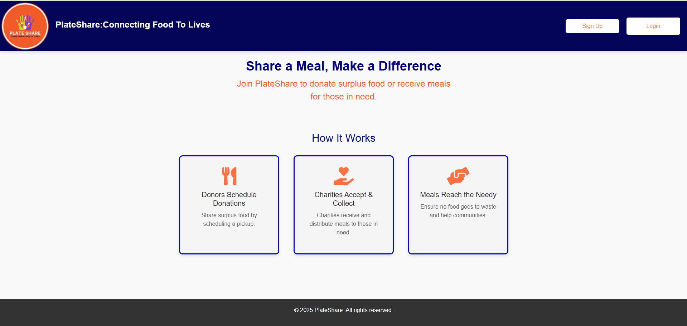
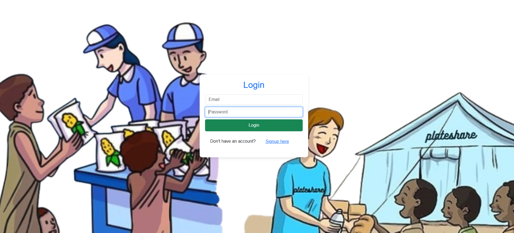
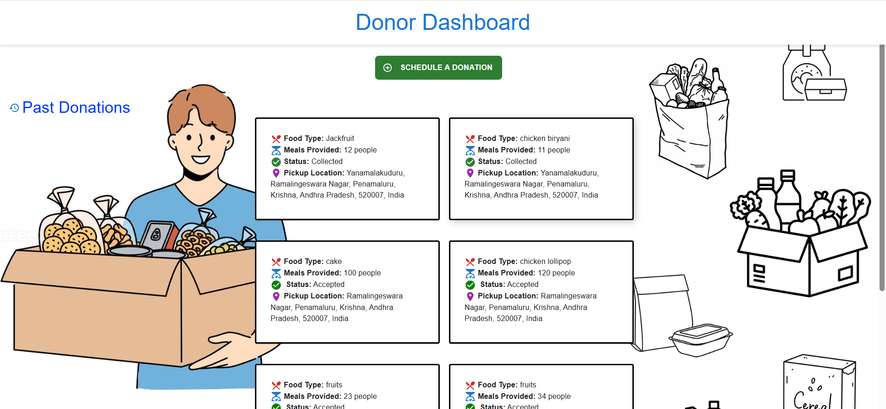
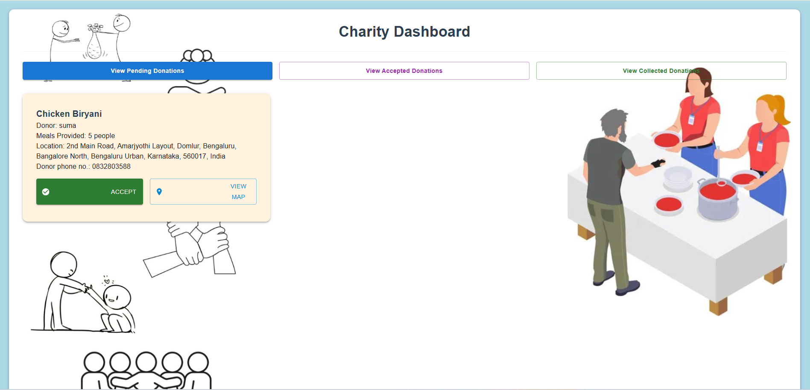
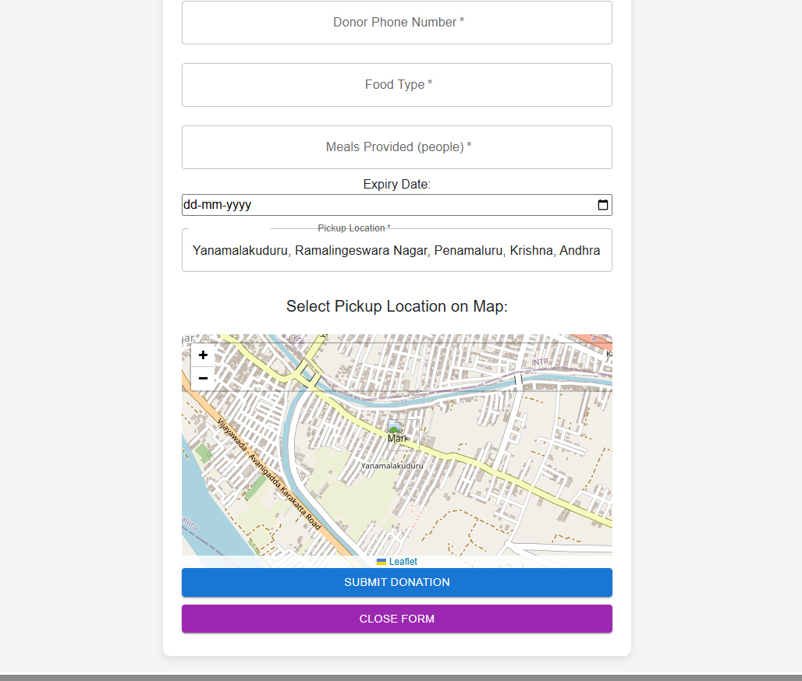

# PlateShare

PlateShare is a full-stack MERN web app that connects food donors and recipients to reduce food waste and support those in need.

## 🍽️ Key Features
- Login as Donor or Charity
- Donor Dashboard: Schedule & track donations
- Charity Dashboard: View, accept, and update donation status
- Email notifications keep donors informed
- Admin Panel to manage users and donations

## 🔗 Live Demo
Check out the live site: [https://lnkd.in/g7WwN2qA](https://lnkd.in/g7WwN2qA)

## Screenshots

### Homepage

### Login Page

### Donor Dashboard

### Charity Dashboard

### My Donation Schedule

## Technologies Used
- MongoDB
- Express.js
- React.js
- Node.js

